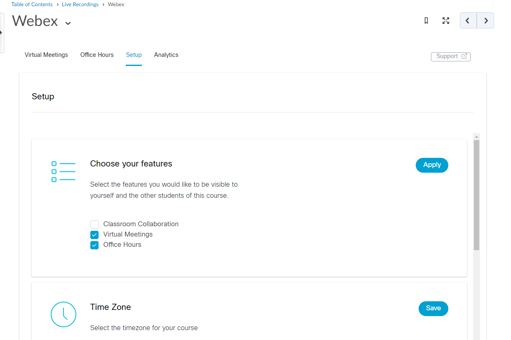
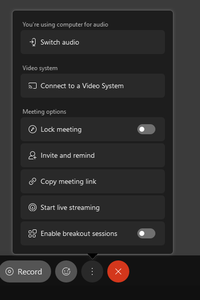
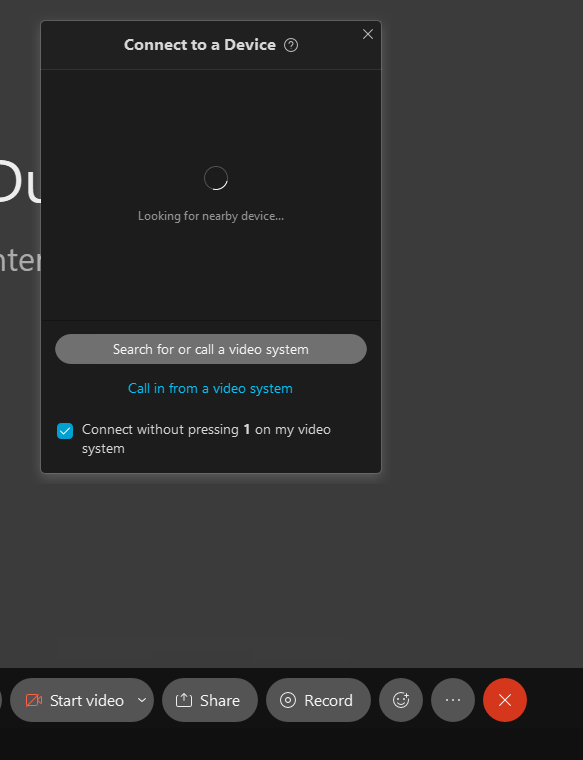
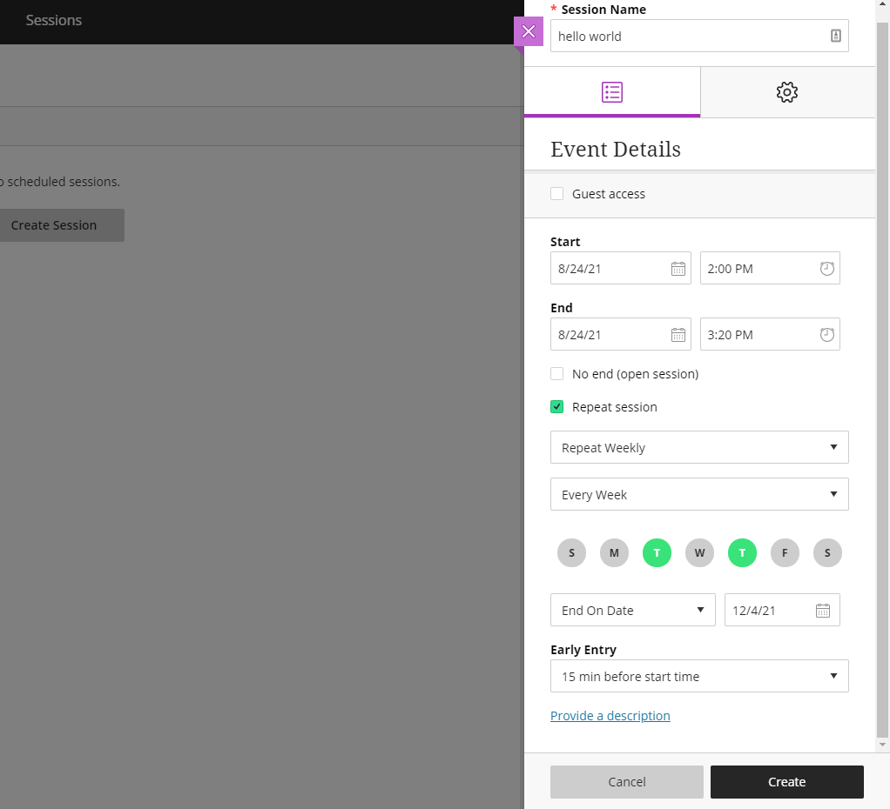

# Remote Learning Tools

## Adding Webex to Pilot

Add Webex to Pilot:
1. Log in to [pilot.wright.edu](pilot.wright.edu)
2. Select the course in which you want to use Webex - you will need to repeat this process for each course
3. Go to Content, and create a new module ("Add a module...")
4. Select "Add Existing Activities"
5. Select "External Learning Tools"
6. Scroll down and select "Webex"
7. This should add a clickable Webex link to your module.  
    - This is where you and students will go to access lecture sessions and recordings

## Setup Webex Sessions

1. When you first open Webex from your link added to the module you made in Content, you will need to setup the features you want to enable.
    - 
    - You can change this later - the Setup tab will remain accessible
    - Recommended settings:
    - Under "Choose your features", **check "Virtual Meetings"**, then select "Apply"
    - Under "Authorize with LMS", make sure it says "Authorized"
    - You can now setup meetings that if scheduled via Webex in Pilot students enrolled in the course can access
2. Under the "Virtual Meetings" tab, select "New Meeting".  
    - You can choose to setup a recurring meeting (sample in screenshot) or you can create meetings for each lecture separately
        - You cannot delete individual meetings in a recurring set
    - 
3. The "Meetings" tab has three mini tabs to select from - "Upcoming", "Past Meetings", and "Recordings"
    - The "Upcoming" tab is where you select which meeting to "Start"
    - When ready "Start" your meeting - students will not be able to join a meeting until it has been started

## Using Webex with in-room equipment
**Note: This is for Russ 346 and 355 / any room with a Webex panel and Cisco camera in the room**

1. In Pilot, go to your course, open Webex from your module in Content
2. Under the "Virtual Meetings" tab, look at your "Upcoming" meetings
3. "Start" the meeting to launch Webex
4. "Start meeting" once ready
5. If using the **in room instructor station**, you should now be connected to the room microphone, Cisco control panel (we're getting there) and the in-room camera.
6. If using **your own device** (laptop), you will need to connect to the room
    - Select the "..." icon in the bottom row of icons
    - Click "Connect to a Video System"
    - 
    - A window will open where you can select which room to connect to
    - 
    - You should now be connected to the room microphone, Cisco control panel (we're getting there) and the in-room camera.
7. You can choose to share your screen, which screen to share, or specific applications to share.
    - 
8. You can now monitor text chat within Webex.  Depending on your configuration (see additional webex info), students who attend remotely can unmute their microphones and ask questions over the in-room speakers.
9. You can record your class (click the "Record" button)
    - 
    - Make sure "Record in cloud" is the selected option
    - When recording, you can choose to "Pause" or "Stop" the recording.  
        - "Pause" will allow you to resume a recording session.  
        - "Stop" will finish the first recording, and "Start" would then start a new recording
10. When done with your session, select the red X and "End Meeting"
    - If students are still in the session, you can optionally "Leave Meeting" - you will leave, but the session remains on for those joined

## Using Webex Control Panel (changing camera views)
**Note: This is for Russ 346 and 355 / any room with a Webex panel and Cisco camera in the room**

1. On the desk there is a white bordered touchscreen panel.  This is the Webex control panel
2. On the upper right of the panel screen, there is a camera icon with settings symbols overlayed.
3. To change the current camera behavior, select that button.  You have options:
    - Whiteboard: a view tailored to the room's whiteboard
    - [Fill with right word]: a view of the whole room
    - [Fill with right word]: enables camera to track instructor
    - **does this reset to anything after any time period / is there a default???**

## Using Webex on any device
**Note: This is for Russ 152C and Oelman Hall 320 / any room WITHOUT a Webex panel**

1. In Pilot, go to your course, open Webex from your module in Content
2. Under the "Virtual Meetings" tab, look at your "Upcoming" meetings
3. "Start" the meeting to launch Webex
4. "Start meeting" once ready
5. You can choose to share your screen, which screen to share, or specific applications to share.
6. You can now monitor text chat within Webex.  Depending on your configuration (see additional webex info), students who attend remotely can unmute their microphones and ask questions over the in-room speakers.
7. You can record your class (click the "Record" button)
    - Make sure "Record in cloud" is the selected option
    - When recording, you can choose to "Pause" or "Stop" the recording.  
        - "Pause" will allow you to resume a recording session.  
        - "Stop" will finish the first recording, and "Start" would then start a new recording
8. When done with your session, select the red X and "End Meeting"
    - If students are still in the session, you can optionally "Leave Meeting" - you will leave, but the session remains on for those joined

## Additional Webex info:

- Disable participant leave / join dings
- Mute students on join
- [wright.webex.com](wright.webex.com): once logged in, you have access to a personal room, and can view meetings you have created or been invited to in webex (anything using your wright.edu account)
- Changing recording names
    - legit - go through wright.webex.com - can cause time delays?  Haven't tested in a while
    - Test in progress 8/9 - changed "test" to "hello?" - need to monitor Recordings
    - hacked - get link from wright.webex.com In Pilot, add to link and title as desired
- Using breakout rooms?
- Office Hours?

## Additional Webex Control Panel info:
- Call another room
- Share content
- Join another meeting?

## Setup Collaborate in Pilot
**Note** For best integration, we recommend Webex over Collaborate Ultra

1. Select the "Communication" dropdown
2. Select "Collaborate Ultra"

## Setup Collaborate Sessions

1. Open Collaborate Ultra via the Communication dropdown in Pilot
2. You can choose to setup a recurring meeting (sample in screenshot) or you can create meetings for each lecture separately
    - 
3. In the Sessions menu, you can select the session you want to join (listed by date), then select "Join session"

## Using Collaborate

1. Open Collaborate Ultra via the Communication dropdown in Pilot
2. In the Sessions menu, you can select the session you want to join (listed by date), then select "Join session"
**UNTESTED**
3. If using the **in room instructor station**, you should now be connected to the room microphone, Cisco control panel (we're getting there) and the in-room camera.
4. If using **your own device** (laptop), you cannot connect to the in-room Cisco equipment
    - You only have your PC hardware (built in mic and camera)
5. You can choose to share your screen, which screen to share, or specific applications to share.
6. You can now monitor text chat within Collaborate.  Depending on your configuration, students who attend remotely can unmute their microphones and ask questions.
7. You can record your class:
    - In the upper left panel, click "Start Recording"
    - To stop the recording, in the upper left panel, click "Stop Recording"
8. When done with your session, open the upper left panel, then in the bottom left select "Leave Session"