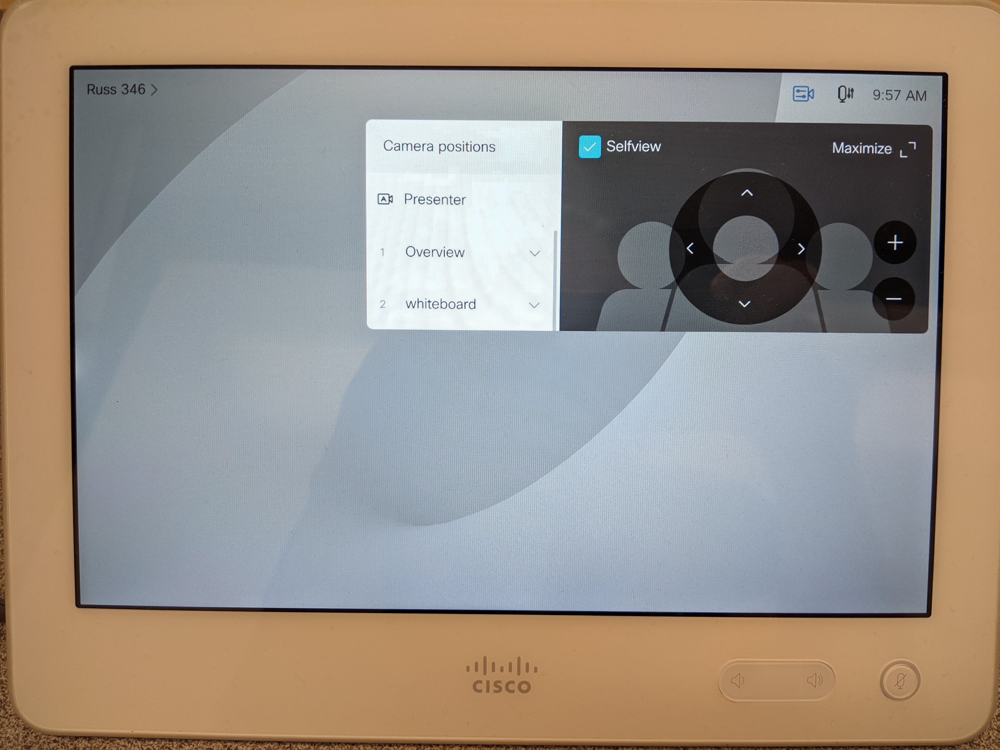

# Instructor Guide to Blackboard Collaborate Ultra

- [Setup Collaborate in Pilot](#Setup-Collaborate-in-Pilot)
- [Setup Collaborate Sessions](#Setup-Collaborate-Sessions)
- [Using Collaborate](#Using-Collaborate)
- [Camera Settings Using Webex Control Panel](#Camera-Settings-Using-Webex-Control-Panel)
- [Additional Webex Control Panel info](#Additional-Webex-Control-Panel-info)
- [Breakout Sessions - Collaborate Guide](https://help.blackboard.com/Collaborate/Ultra/Moderator/Moderate_Sessions/Breakout_groups)
- [Polling - Collaborate Guide](https://help.blackboard.com/Collaborate/Ultra/Moderator/Moderate_Sessions/Polling)

## Setup Collaborate in Pilot
**Note** For best integration, we recommend Webex over Collaborate Ultra

1. Select the "Communication" dropdown
2. Select "Collaborate Ultra"

- [Back to Top](#Instructor-Guide-to-Blackboard-Collaborate-Ultra)

## Setup Collaborate Sessions

1. Open Collaborate Ultra via the Communication dropdown in Pilot
2. You can choose to setup a recurring meeting (sample in screenshot) or you can create meetings for each lecture separately
    - 
3. In the Sessions menu, you can select the session you want to join (listed by date), then select "Join session"

- [Back to Top](#Instructor-Guide-to-Blackboard-Collaborate-Ultra)

## Using Collaborate

1. Open Collaborate Ultra via the Communication dropdown in Pilot
2. In the Sessions menu, you can select the session you want to join (listed by date), then select "Join session"
3. If using the **in room instructor station**, you should now be connected to the room microphone, Cisco control panel (we're getting there) and the in-room camera.
    - Room microphone - MO-1 **NEEDS VERIFICATION**
    - Room camera - INOGENI (HD2USB3)
    - Can use control panel to change camera views
    - **MAKE SURE YOU UNMUTE AND SHARE YOUR VIDEO ONCE READY**
    - If you want video to show for recording, you need to stop sharing content (screenshare / whiteboard / etc.)
4. If using **your own device** (laptop), you cannot connect to the in-room Cisco equipment
    - You only have your PC hardware (built in mic and camera) and any external hardware you want to add (external microphone)
    - **MAKE SURE YOU UNMUTE AND SHARE YOUR VIDEO ONCE READY**
5. You can choose to share your screen, which screen to share, or specific applications to share.
6. You can now monitor text chat within Collaborate.  Depending on your configuration, students who attend remotely can unmute their microphones and ask questions.
7. You can record your class:
    - In the upper left panel, click "Start Recording"
    - To stop the recording, in the upper left panel, click "Stop Recording"
8. When done with your session, open the upper left panel, then in the bottom left select "Leave Session"

- [Back to Top](#Instructor-Guide-to-Blackboard-Collaborate-Ultra)

## Camera Settings Using Webex Control Panel
**Note: This is for Russ 346 and 355 / any room with a Webex panel and Cisco camera in the room**

1. On the desk there is a white bordered touchscreen panel.  This is the Webex control panel
2. On the upper right of the panel screen, there is a camera icon with settings symbols overlayed.
3. To change the current camera behavior, select that button.  You have options:
    - Presenter: enables camera to track instructor
    - Overview: a view of the whole room
    - Whiteboard: a view tailored to the room's whiteboard
    - **does this reset to anything after any time period / is there a default???**
    - 

- [Back to Top](#Instructor-Guide-to-Blackboard-Collaborate-Ultra)

## Additional Webex Control Panel info
- 
- Call: call another room on campus equiped with a Webex panel
- Share screen: share content to projector via the panel
- Join Webex: Join webex meeting using meeting number or personal room ID
- To show these options (once selected) on projector, on projector control panel, select "See Far Site"

- [Back to Top](#Instructor-Guide-to-Blackboard-Collaborate-Ultra)
