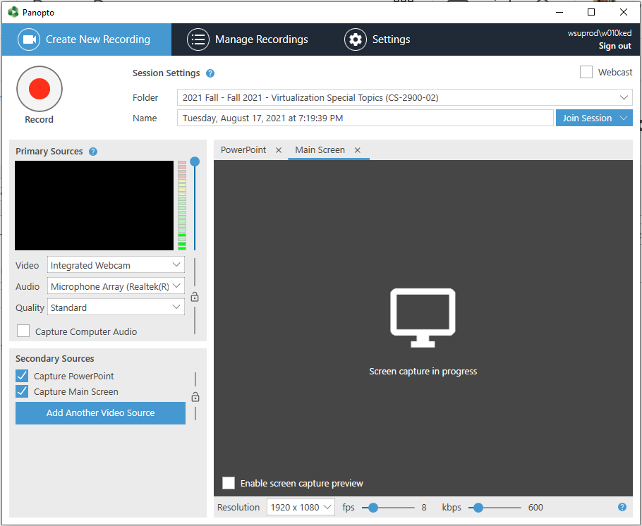
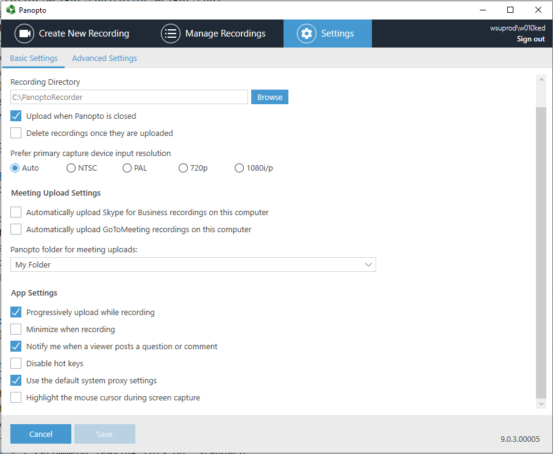

# Instructor Guide to Panopto

- **Note** As of this writing, Panopto is good for recording lectures, NOT for live remote lectures
    - When a Panopto session is "Webcast", we have tested a ~50 second delay between the live session and the remote viewers
    - See [Live lectures with Panopto](#Live-lectures-with-Panopto) latest experience

- [Setup Panopto in Pilot](#Setup-Panopto-in-Pilot)
- [Automatic recordings with Panopto](#Automatic-recordings-with-Panopto)
- [Sysadmin guide to scheduling Panopto recordings](#Sysadmin-guide-to-scheduling-Panopto-recordings)
- [Installing Panopto on your system](#Installing-Panopto-on-your-system)
- [Using Panopto recorder on your system](#Using-Panopto-recorder-on-your-system)
- [Editing Panopto recordings](#Editing-Panopto-recordings)
- [Additional Panopto info](#Additional-Panopto-info)
- [TODO](#TODO)

## Setup Panopto in Pilot

Add Panopto to Pilot:
1. Log in to [pilot.wright.edu](pilot.wright.edu)
2. Select the course in which you want to use Panopto - you will need to repeat this process for each course
3. Go to Content, and create a new module ("Add a module...")
4. Select "Add Existing Activities"
5. Select "External Learning Tools"
6. Scroll down and select "Panopto"
7. This should add a clickable Panopto link to your module.  
    - This is where you and students will go to access lecture sessions and recordings
8. **Click in to the link** - this final step creates the folder for the course in Panopto

- [Back to Top](#Instructor-Guide-to-Panopto)

## Automatic recordings with Panopto

**This assumes you are using a room with Panopto remote recorder - such as Russ 339**
1. [Setup Panopto in Pilot](#Setup-Panopto-in-Pilot) per the instructions
2. Email the department sysadmin with your:
    - Course name
    - Course start time and end time
    - If you would like the recording to go **past** the official end time
3. You can delete sessions that fall on holidays or other days
4. Once your recordings are setup by the admin, you are done
    - No action needed from you
    - Recordings will start at the specified time
    - You cannot intervene (halt) the recordings

- [Back to Top](#Instructor-Guide-to-Panopto)

## Sysadmin guide to scheduling Panopto recordings
**This assumes you are using a room with Panopto remote recorder - such as Russ 339**

-TODO

- [Back to Top](#Instructor-Guide-to-Panopto)

## Installing Panopto on your system
You only need to install Panopto in order to make recordings using your system.

1. Open Panopto from the link added to the module you made in Content
2. Click on the green "Create" dropdown
3. Select "Panopto for [X]", Panopto will try to detect your OS (Mac or Windows) and provide the appropriate installer
4. Select from the installer options next to Panopto
5. If prompted to sign in, the appropriate fields should have been autofilled (by using the installer from Pilot)
    - If you are signed out, it is recommended you go back to Pilot and launch Panopto from the Create button again

- [Back to Top](#Instructor-Guide-to-Panopto)

## Using Panopto recorder on your system

- When you launch Panopto, you should see this view by default:
    - If you are signed out, it is recommended you go back to Pilot and launch Panopto from the Create button again
- 
- From the recorder GUI, you can select a series of options including:
    - Which folder you want the recording to upload to
    - Name of the recording
    - Which video sources (if any) - this is where you would select your webcam, for example
    - Audio - this is where you select your microphone be it built in, a USB mic, etc.
    - Quality - I recommend leaving this on "Standard"
    - Capture Computer Audio - select this if you would like to capture audio from computer (such as if you are showing videos)
    - Capture PowerPoint - Panopto can use PowerPoint content in order to organize the recording - it's cool and I would leave it on
    - Capture Main Screen - use this if you want your screen to be captured - you can have both PowerPoint and Main Screen selected
- Once your settings are configured, select "Record"
    - You can "Pause" recordings - if resumed, the recording will be part of the same recording session
    - You can "Stop" recordings - if resumed, the recording will be a seperate session
- Settings has additional customization settings you can select for behavior
- 
    - Recording Directory - which directory you want recordings to save to.  Useful to note if you have multiple disks
    - Upload when Panopto is closed - continuing uploading recordings even if you "close" out of Panopto - this is good
    - Delete recordings once they are uploaded - space saving settings - once recordings are in the cloud, delete from your local machine
    - App settings 
        - minimize the application when recording
        - enable mouse / cursor highlighting

- [Back to Top](#Instructor-Guide-to-Panopto)

## Editing Panopto recordings

- Any recording in Panopto can be edited
- [Guide to Editing Videos - Panopto Official](https://support.panopto.com/s/article/Edit-a-Video)

- [Back to Top](#Instructor-Guide-to-Panopto)

## Additional Panopto info

- Video dropbox for students
    - Click the Settings icon
    - In the Overview tab, under Assignment Folder, click Create Assignment Folder
    - Students can now create content and upload it to specifically this folder
        - Students are able to install Panopto on their systems
- Enable downloads
    - Click the Settings icon
    - In the Settings tab, select the dropdown next to Downloads enabled
    - Select "Authenticated users with access" - this will include only students enrolled in your course (as listed in Pilot)
- Video statistics
    - Click the bar chart icon labeled Folder stats
    - From here you can view:
        - video statistics (is there a commonly watched portion of a lecture?)
        - user viewing statistics (what user watched what video and for how long?)
        - and more (probably)
- Upload media / recordings made outside Panopto
    - If you have video material that was created outside of Panopto, you can still make it accessible via the Panopto folder
    - Select "Create", then select "Upload media"
    - This tools supports /most/ standard video types

- [Back to Top](#Instructor-Guide-to-Panopto)

## Live lectures with Panopto

- While you can start your recording as a stream, there are issues with delays in live streaming
- As of this writing (8/13/2021) we tested a 50 second delay for live viewers
- Live viewers can only interect with the instructor using a chat box
- As of this writing (8/13/2021) there is no way for remote users to join and use their microphone

- [Back to Top](#Instructor-Guide-to-Panopto)

## TODO
- Test the [Panopto + Webex integration](https://support.panopto.com/s/article/How-to-Set-Up-a-Webex-Meetings-Integration)

- [Back to Top](#Instructor-Guide-to-Panopto)

