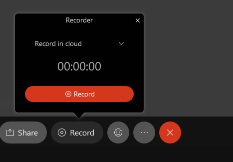

# Instructor Guide to Webex

- [Setup Webex in Pilot](#Setup-Webex-in-Pilot)
- [Setup Webex Sessions](#Setup-Webex-Sessions)
- [Using Webex with in-room equipment](#Using-Webex-with-in-room-equipment)
- [Using Webex on any device](#Using-Webex-on-any-device)
- [Using Yeti microphone - RC 152C & OH 320](#Using-Yeti-microphone)
- [Useful settings during Webex meetings](#Useful-settings-during-Webex-meetings)
- [Camera Settings Using Webex Control Panel](#Camera-Settings-Using-Webex-Control-Panel)
- [Additional Webex Control Panel info](#Additional-Webex-Control-Panel-info)
- [Breakout Rooms](#Breakout-Rooms)
- [Polling](#Polling)
- [Editing Recordings](https://help.webex.com/en-us/0zbv00/Trim-the-Beginning-and-End-of-Your-Webex-Meetings-or-Events-Recording)
- [Deleting Recordings](#Deleting-Recordings)
- [Office Hours](#Office-Hours)
- [Additional Webex info](#Additional-Webex-info)
- [Training Session Videos - Recorded](#Training-Sessions)
- [TODOS](#TODOS)

## Adding Webex to Pilot

- [WSU CTL Documentation](http://blogs.wright.edu/learn/pilot/2020/11/30/6518/)

Add Webex to Pilot:
1. Log in to [pilot.wright.edu](pilot.wright.edu)
2. Select the course in which you want to use Webex - you will need to repeat this process for each course
3. Go to Content, and create a new module ("Add a module...")
4. Select "Add Existing Activities"
5. Select "External Learning Tools"
6. Scroll down and select "Webex"
7. This should add a clickable Webex link to your module.  
    - This is where you and students will go to access lecture sessions and recordings

- [Back to Top](#Instructor-Guide-to-Webex)

## Setup Webex Sessions

- [WSU CTL Documentation](http://blogs.wright.edu/learn/pilot/2020/11/30/6518/)

1. When you first open Webex from your link added to the module you made in Content, you will need to setup the features you want to enable.
    - 
    - You can change this later - the Setup tab will remain accessible
    - Recommended settings:
    - Under "Choose your features", **check "Virtual Meetings"**, then select "Apply"
    - Under "Authorize with LMS", make sure it says "Authorized"
    - You can now setup meetings that if scheduled via Webex in Pilot students enrolled in the course can access
2. Under the "Virtual Meetings" tab, select "New Meeting".  
    - You can choose to setup a recurring meeting (sample in screenshot) or you can create meetings for each lecture separately
        - You cannot delete individual meetings in a recurring set
    - 
3. The "Meetings" tab has three mini tabs to select from - "Upcoming", "Past Meetings", and "Recordings"
    - The "Upcoming" tab is where you select which meeting to "Start"
    - When ready "Start" your meeting - students will not be able to join a meeting until it has been started

- [Back to Top](#Instructor-Guide-to-Webex)

## Using Webex with in-room equipment
**Note: This is for Russ 346 and 355 / any room with a Webex panel and Cisco camera in the room**

1. In Pilot, go to your course, open Webex from your module in Content
2. Under the "Virtual Meetings" tab, look at your "Upcoming" meetings
3. "Start" the meeting to launch Webex
4. "Start meeting" once ready
5. If using the **in room instructor station**, you should now be connected to the room microphone, Cisco control panel (we're getting there) and the in-room camera.
    - If you want video to show for recording, you need to stop sharing content (screenshare / whiteboard / etc.)
6. If using **your own device** (laptop), you will need to connect to the room
    - Select the "..." icon in the bottom row of icons
    - Click "Connect to a Video System"
    - 
    - A window will open where you can select which room to connect to
    - 
    - You should now be connected to the room microphone, Cisco control panel (we're getting there) and the in-room camera.
    - If you want video to show for recording, you need to stop sharing content (screenshare / whiteboard / etc.)
7. You can choose to share your screen, which screen to share, or specific applications to share.
    - 
8. You can now monitor text chat within Webex.  Depending on your configuration (see additional webex info), students who attend remotely can unmute their microphones and ask questions over the in-room speakers.
9. You can record your class (click the "Record" button)
    - 
    - Make sure "Record in cloud" is the selected option
    - When recording, you can choose to "Pause" or "Stop" the recording.  
        - "Pause" will allow you to resume a recording session.  
        - "Stop" will finish the first recording, and "Start" would then start a new recording
10. When done with your session, select the red X and "End Meeting"
    - If students are still in the session, you can optionally "Leave Meeting" - you will leave, but the session remains on for those joined

- [Back to Top](#Instructor-Guide-to-Webex)

## Camera Settings Using Webex Control Panel
**Note: This is for Russ 346 and 355 / any room with a Webex panel and Cisco camera in the room**

1. On the desk there is a white bordered touchscreen panel.  This is the Webex control panel
2. On the upper right of the panel screen, there is a camera icon with settings symbols overlayed.
3. To change the current camera behavior, select that button.  You have options:
    - Presenter: enables camera to track instructor
    - Overview: a view of the whole room
    - Whiteboard: a view tailored to the room's whiteboard
    - **does this reset to anything after any time period / is there a default???**
    - 

- [Back to Top](#Instructor-Guide-to-Webex)

## Using Webex on any device
**Note: This is for Russ 152C and Oelman Hall 320 / any room WITHOUT a Webex panel**

1. In Pilot, go to your course, open Webex from your module in Content
2. Under the "Virtual Meetings" tab, look at your "Upcoming" meetings
3. "Start" the meeting to launch Webex
4. "Start meeting" once ready
5. You can choose to share your screen, which screen to share, or specific applications to share.
6. You can now monitor text chat within Webex.  Depending on your configuration (see additional webex info), students who attend remotely can unmute their microphones and ask questions over the speakers.
7. You can record your class (click the "Record" button)
    - Make sure "Record in cloud" is the selected option
    - When recording, you can choose to "Pause" or "Stop" the recording.  
        - "Pause" will allow you to resume a recording session.  
        - "Stop" will finish the first recording, and "Start" would then start a new recording
8. When done with your session, select the red X and "End Meeting"
    - If students are still in the session, you can optionally "Leave Meeting" - you will leave, but the session remains on for those joined

- [Back to Top](#Instructor-Guide-to-Webex)

## Using Yeti microphone
**Note: This is for Russ 152C and Oelman Hall 320 - instructor station has microphone and arm**

- When you start your webex meeting, make sure the correct microphone input device is selected
- Yeti should be part of the decive name
- You are allowed to disconnect the mic from the instructor station if using your own device
    - Please plug the cable back in once your session is done

- [Back to Top](#Instructor-Guide-to-Webex)

## Useful settings during Webex meetings

- Disable participant leave / join dings
    - Once session has started, go to the "Paricipant" menu
    - Click "Entry and Exit Tone" to turn off ding sounds as students come and go
- Mute students on join
    - Once session has started, go to the "Participant" menu
    - Click "Mute on Entry" to have students join with there microphones muted by default
- Control student microphone usage
    - Once session has started, go to the "Participant" menu
    - Here you can choose to "Mute All", "Unmute All", and "Allow Attendees to Unmute Themselves"
- Turn on chat notification sounds
    - In the Webex menu (you may need to turn off sharing), select "Edit", then select "Preferences"
    - "When recieving a message" options:
    - "Play the selected sound" checkbox - make sure the box is checked
    - 

- [Back to Top](#Instructor-Guide-to-Webex)

## Additional Webex Control Panel info
- 
- Call: call another room on campus equiped with a Webex panel
- Share screen: share content to projector via the panel
- Join Webex: Join webex meeting using meeting number or personal room ID
- To show these options (once selected) on projector, on projector control panel, select "See Far Site"

- [Back to Top](#Instructor-Guide-to-Webex)

## Breakout Rooms
- [Webex official documentation](https://help.webex.com/en-us/nft9foq/Webex-Meetings-Create-Breakout-Sessions)
- Once the meeting has started, select the "..." icon in the bottom row of icons
- Click the toggle to "Enable Breakout Session" - enabling breakout sessions will open a settings window
- 
- Webex can auto break students out into the number of groups you specify
    - You can choose to manually asign users to a session
    - You can choose to let student select the session they want to join
- Once you have selected your breakout room configuration, a new window will display
    - From here you can control your sessions by broadcasting messages to all sessions, joining sessions, and setting session time
    - 
- To **end** the breakout sessions, either use the session control menu to select the red "End all breakout sessions" button
    - Alternatively, click "Breakout sessions" in the menu bar then select "End All Breakout Sessions"

- [Back to Top](#Instructor-Guide-to-Webex)

## Polling

- As of this writing (8/13/2021), to use polling you need to add it during your session
- In the session menu, select "View", "Panels", "Manage Panels"
- In the window that appears, select "Polling", then select "Add >" , then select "OK"
    - [Resource from Webex](https://help.webex.com/en-us/n0pdj9x/Start-a-Poll-in-Webex-Meetings#task_6531E05B157C77BEEFF02E329A98FC3D)
- In the Polling window, you can create and deploy multiple choice or short answer questions
- 
- Select your question type, then select "New"
- Your cursor will be above in "Poll questions"
    - Write your question, then hit enter
    - Write each possible response - hit enter after each response choice
    - Hit escape to stop typing
- Select "Open Poll" at the bottom to deploy your question
- 
- You can see the results as a percentage or a bar chart
- You can stop the poll by selecting "Close Poll"
- You can save poll questions and responses
    - I recommend saving common questions, like "Are you following?  Yes / No"
- You can import polling questions (if you saved them) by clicking the "Open" folder icon in the Poll menu

- [Back to Top](#Instructor-Guide-to-Webex)

## Deleting Recordings
**Note** This method tested as of 8/22 - we are hoping for something better...

- Go to [wright.webex.com](wright.webex.com)
- In the sidebar, select "Recordings"
- Click the checkmark for the recording(s) you would like to delete
    - Alternatively, you can select the three horizontal dots and select "Delete"
- Select Delete on the upper right
- This will remove the recording
- The name of the session will still be listed in Pilot, but the recording will no longer be accessible when students click through.

- [Back to Top](#Instructor-Guide-to-Webex)

## Office Hours
**This section is for the Office Hours tool via Webex.  You can still set up other methods, like using your personal Webex room**

- Office Hours via Pilot + Webex allow for you to create windows of your availability - students can then pick a time that works for them within your selected window
    - If you are familar with "whenisgood" or "youcanbookme" this feature is very similar to how those platforms operate
- To enable Office Hours, select the "Setup" tab 
    - Under "Choose your features", **check "Office Hours"**, then select "Apply"
- Select the Office Hours tab
- Select your hours of availability (this is for all weeks)
- Select meeting duration (30 minutes by default)
- Select default buffer time (if any) you would like between meetings
- 
- **Click Save** at the bottom once you are finished with your selections
- Students will see your available time slots only, can select a time, and can select "Confirm Meeting" to reserve the time slot
- Select "View My Meetings in Webex"
    - This will take you to the Webex portal, where you can join meetings with students who have reserved time slots.
- Office Hours DO span across courses where you have added Webex and selected "Office Hours" in the "Setup" options
    - TODO: test if students see taken times across courses

- [Back to Top](#Instructor-Guide-to-Webex)

## Additional Webex info
- [wright.webex.com](wright.webex.com): once logged in, you have access to a personal room, and can view meetings you have created or been invited to in webex (anything using your wright.edu account)
- Changing recording names
    - legit - go through wright.webex.com - can cause time delays?  Haven't tested in a while
    - Test in progress 8/9 - changed "test" to "hello?" - need to monitor Recordings - showed.  Unknown time consequences
    - hacked - get link from wright.webex.com In Pilot, add to link and title as desired

- [Back to Top](#Instructor-Guide-to-Webex)

## Training sessions

- [WSU CaTS hosted 8/20/21](https://www.youtube.com/watch?v=c7k0BWdZTFk&ab_channel=WSUCenterforTeachingandLearning)

- [Back to Top](#Instructor-Guide-to-Webex)

## TODOS:
- TODO: verify ceiling mic ID
    - Mics - USB Audio Device / Shure Digital - These are the two mic types
        -  USB video adaptor is wrong
    - Cameras - INOGENI HD2USB3
- TODO: check what students do after reserving a time in Office Hours
- TODO: add instructions for seeing class cam (confirmation)
- TODO: wright.webex.com
- TODO: do office hours sync across courses?
    - They DO, so what do students see?
- TODO: browser based webex capabilities (linux test)
- TODO: can share screen share to breakout rooms (Zoom can)

- [Back to Top](#Instructor-Guide-to-Webex)

